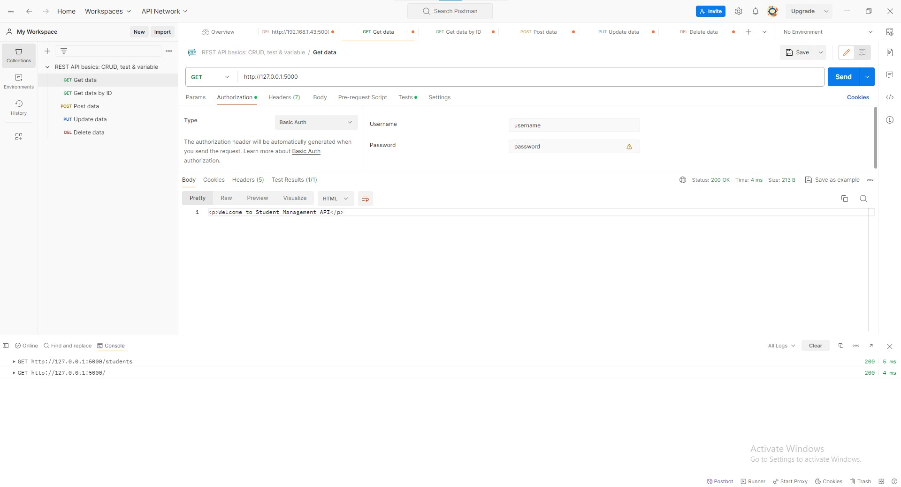
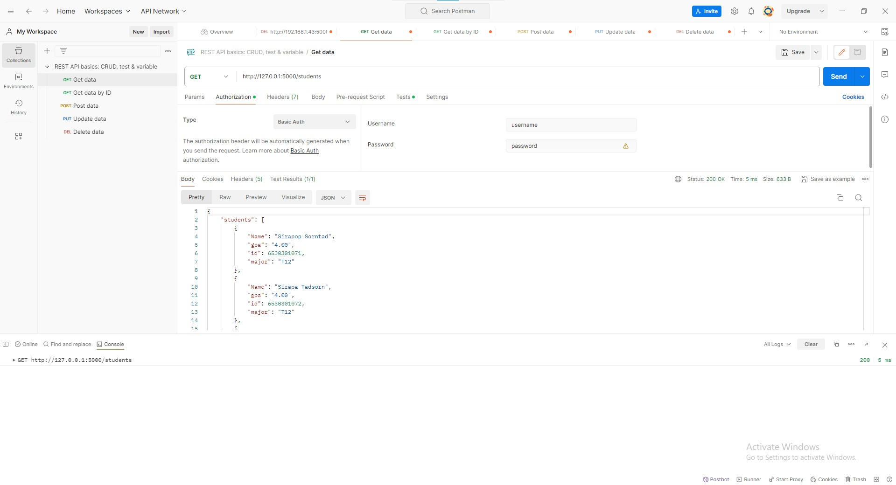
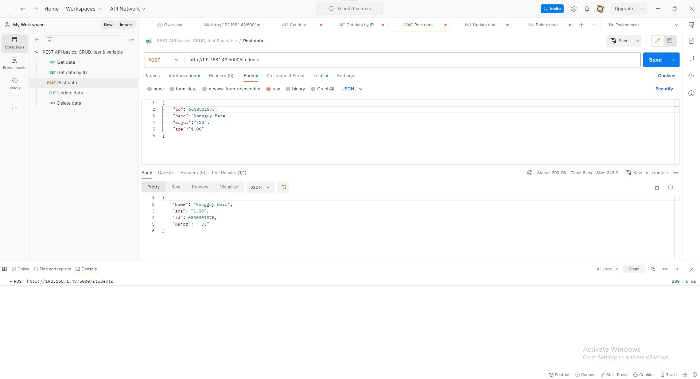
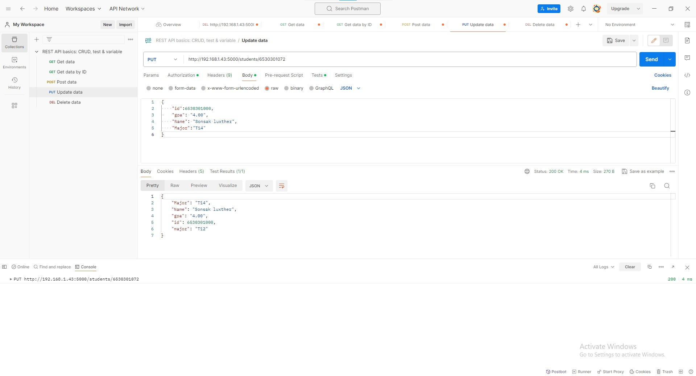
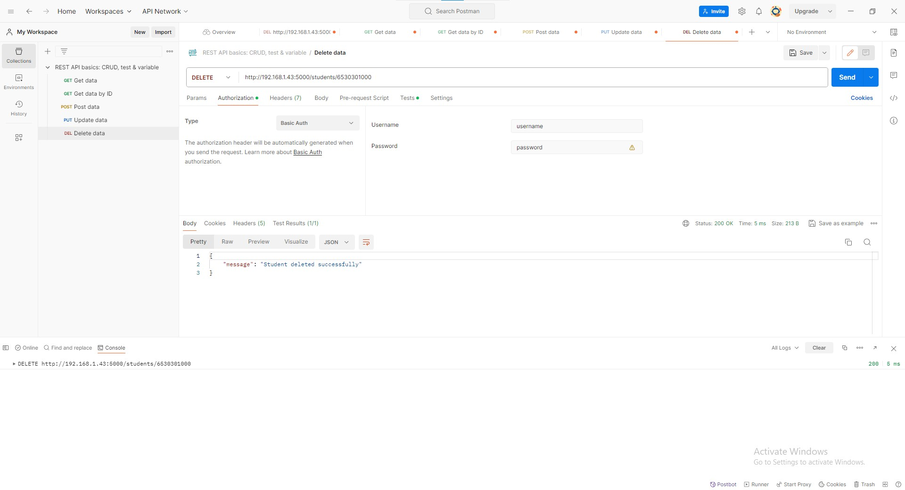

#BackEnd Management API  
===========  
 
/    
 
/students #GET    
 
/students/<int:std_id> #GET    
 
/students #POST    
 
/students/<int:std_id> #PUT    
 
/students/<int:std_id> #DELETE    
